## Hi, I'm Hogan

<details><summary>Portfolio-CLICK ME</summary>
NCKU Modular System：https://modular-course.science.ncku.edu.tw/index.php <br />
NCKU Bill Platform：https://pay.ufo.ncku.edu.tw/mobilepay/ <br />
NUTN USR：http://tfre.nutn.edu.tw/ <br />
Ansir：https://www.ansir.com.tw/ <br />
Ainimal：https://official.ainimal.io/#/ <br />
</details>

Software Engineer → Indie Builder → AI Systems

I build products, content, and systems at the intersection of engineering and distribution.

### Featured Project
**[LeetCode Solution Repository](https://github.com/hogan-tech/leetcode-solution)**  
A comprehensive collection of 4,000+ LeetCode problem solutions written in Python, C++, JavaScript, TypeScript, and SQL.  
The repository has gained over 480+ stars and is designed to help developers prepare for coding interviews, learn algorithms, and compare multi-language approaches.


<span>


</span>

**This week I spent my time on:**
<br />

<!--START_SECTION:waka-->

```txt
Other    3 hrs                 █████████████████████░░░░   83.60 %
Erlang   27 mins               ███░░░░░░░░░░░░░░░░░░░░░░   12.54 %
Groovy   7 mins                █░░░░░░░░░░░░░░░░░░░░░░░░   03.51 %
Java     0 secs                ░░░░░░░░░░░░░░░░░░░░░░░░░   00.35 %
```

<!--END_SECTION:waka-->

## Github Stats

<br />
<span>
  
  
</span>

## Leetcode Stats

<br />
<span>

</span>
<br />

## Trophies:
[](https://github.com/ryo-ma/github-profile-trophy)
